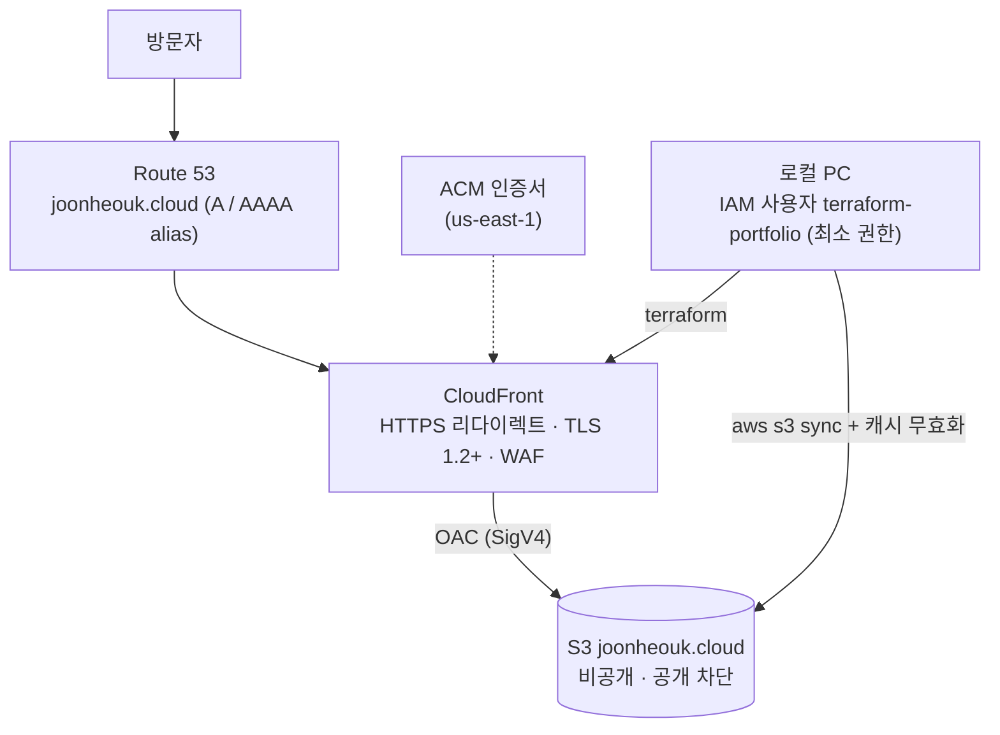

# portfolio-site

개인 포트폴리오 사이트 [joonheouk.cloud](https://joonheouk.cloud)의 인프라 코드와 콘텐츠입니다.

AWS 콘솔로 직접 만들어 운영하던 인프라를 **사이트 중단 없이 Terraform으로 import**해 코드로 관리하고, 배포용 IAM 권한을 **이 사이트 리소스로만** 좁혔습니다.

- 기간: 2026.10.04 – 2026.10.06
- 스택: Terraform 1.16 · AWS provider 6.67 · S3 · CloudFront (OAC) · ACM · Route 53 · IAM · AWS CLI

## 핵심 결과

| 항목 | 결과 |
|---|---|
| import | 기존 리소스 11개. `11 to import, 0 to add, 0 to change, 0 to destroy` 확인 후 import → `No changes` |
| 무중단 | import와 콘텐츠 배포 동안 인프라 변경 0건 |
| 인프라·콘텐츠 분리 | 콘텐츠 배포 후에도 `terraform plan` → `No changes` |
| 최소 권한 | 배포 사용자는 이 사이트 리소스만 접근. 다른 버킷과 계정 버킷 목록은 `AccessDenied` 확인 |

## 아키텍처



## 관리 대상 (11개)

| Terraform 리소스 | 역할 |
|---|---|
| `aws_s3_bucket`, `aws_s3_bucket_public_access_block`, `aws_s3_bucket_policy` | 원본 버킷. 공개 차단 4종, CloudFront의 이 배포에서 온 요청만 `GetObject` 허용 |
| `aws_cloudfront_origin_access_control`, `aws_cloudfront_distribution` | HTTPS 배포, S3는 OAC로 비공개 연결 |
| `aws_acm_certificate` | `joonheouk.cloud`, `www.joonheouk.cloud` 인증서 (us-east-1) |
| `aws_route53_zone`, `aws_route53_record` × 4 | 호스팅 영역, A/AAAA alias, 인증서 DNS 검증 레코드 2개 |

관리하지 않는 것: NS·SOA(호스팅 영역 자동 관리), WAF 웹 ACL(연결만 유지), 사이트 파일(CLI로 배포), 사이트와 무관한 다른 버킷.

## 작업 과정

1. **읽기 전용 조사**: AWS CLI로 현재 인프라를 먼저 확인. 목록 API(요약본)에선 기본 루트 객체가 `null`로 보였지만 상세 조회로 `index.html` 확인. 인증서 SAN에 `www`가 포함돼 있어, CloudFront가 `www`를 받지 않아도 **`www` 검증 레코드는 자동 갱신에 필요**하다고 판단해 관리 대상에 포함.
2. **코드 작성**: `import` 블록과 `-generate-config-out`으로 현재 설정을 받아본 뒤, Route 53 레코드처럼 자동 생성이 틀리는 부분(alias와 records 충돌)은 직접 작성. 버킷 정책의 CloudFront ARN 등은 문자열 대신 **리소스 참조**로 연결.
3. **import**: plan을 파일로 저장(`-out`)하고 그 계획 그대로 적용. import 직후, import 블록을 지운 뒤에도 `No changes` 확인. import 블록은 기록으로 첫 커밋에 남기고 다음 커밋에서 삭제.
4. **콘텐츠 배포**: `--dryrun` → `s3 sync` → 캐시 무효화 → 응답 크기와 `X-Cache: Miss from cloudfront`로 새 파일이 나가는지 확인 → `terraform plan` `No changes`.
5. **최소 권한**: 관리형 FullAccess 정책 4개를 이 사이트의 버킷·배포·OAC·인증서·호스팅 영역 ARN만 허용하는 정책([iam/terraform-portfolio-policy.json](iam/terraform-portfolio-policy.json))으로 교체.

## 설계 결정

| 결정 | 이유 | 대가 |
|---|---|---|
| 인프라는 Terraform, 콘텐츠는 CLI | 인프라는 거의 안 바뀌고 콘텐츠는 자주 바뀜. 문구 수정마다 apply할 필요 없음 | 배포 절차가 두 갈래 |
| 버킷·배포·인증서·호스팅 영역에 `prevent_destroy` | 코드 실수로 교체·삭제 계획이 나오면 실행 전에 에러로 차단 | 의도적 삭제 시 설정을 먼저 풀어야 함 |
| IAM 정책은 저장소에 보관, 적용은 관리자가 | 배포 주체가 자기 권한을 수정할 수 있으면 최소 권한이 무의미 | 권한 변경이 수동 단계 |
| 계획 파일 저장 후 apply | 검토한 계획과 실제 실행이 달라지지 않게 | 단계 하나 추가 |
| WAF는 연결만 유지 | 콘솔 생성 시 함께 만들어진 리소스. 코드에서 빠지면 Terraform이 연결을 해제하려 함 | WAF 설정 자체는 코드 밖 |

## 트러블슈팅

**1. 권한 부족이 "버킷 새로 생성" 계획으로 보임**
관리형 정책을 떼고 새 정책이 붙기 전, plan이 `aws_s3_bucket.site will be created`를 출력. 조회 권한이 없어 기존 버킷을 "없음"으로 판단한 것. 예상하지 못한 create/destroy가 보이면 apply하지 않고 원인부터 확인한다는 기준을 세움.

**2. IAM 최종 일관성**
정책 내용은 같은데 실행할 때마다 막히는 권한이 바뀜(`ListCachePolicies` → `GetOriginAccessControl`). 정책 버전 v1·v2의 해당 항목을 비교해 정책 내용 문제를 배제하고, `terraform plan -detailed-exitcode`를 반복해 exit `1 → 0 → 0`으로 전파 완료를 확인. 원인이 시간이었으므로 **권한을 추가하지 않음**.

**3. PowerShell 인자 분리**
`-generate-config-out=generated.tf`, `-out=import.tfplan`처럼 `-`로 시작하고 `.`이 있는 인자를 PowerShell이 둘로 나눠 `Too many command line arguments` 발생. 따옴표로 감싸 해결.

**4. `.gitignore` 마지막 줄**
파일 끝 줄바꿈이 없는 상태에서 패턴을 추가해 `crash.log*.tfplan` 한 줄이 됨. `git status`에서 plan 파일이 추적 대상으로 보이는 것을 커밋 전에 발견해 수정.

## 실행 방법

사전 준비: Terraform 1.16, AWS CLI v2, 최소 권한 정책이 연결된 IAM 사용자 자격증명

```powershell
cd infra
terraform init
terraform plan            # 기대: No changes
```

콘텐츠 배포

```powershell
aws s3 sync site/ s3://joonheouk.cloud --dryrun
aws s3 sync site/ s3://joonheouk.cloud
aws cloudfront create-invalidation --distribution-id E1NNI4T8V6DW3U --paths "/*"
```

## 디렉터리 구조

```
.
├── infra/                                 # Terraform
│   ├── providers.tf, versions.tf          # 서울 + us-east-1(인증서) provider, 버전 고정
│   ├── s3.tf, cloudfront.tf, acm.tf, route53.tf
│   └── .terraform.lock.hcl                # provider 정확한 버전 고정
├── iam/terraform-portfolio-policy.json    # 배포 사용자 최소 권한 정책 (관리자가 적용)
├── site/                                  # index.html, og-image.png
├── .gitattributes                         # 줄바꿈 LF 고정
└── .gitignore                             # tfstate, tfplan, .terraform 제외
```

## 개선 과제

- **원격 state**: 현재 state가 로컬에만 있음 → S3 백엔드 + 잠금
- **자동 배포**: GitHub Actions + OIDC로 장기 액세스 키 없이 sync·캐시 무효화
- **검증 레코드 일반화**: `domain_validation_options` 기반 `for_each`로 하드코딩 제거
- **하드코딩 값 정리**: 계정 ID, 배포 ID 등을 변수·데이터 소스로
- **www 연결**: 인증서엔 이미 포함, CloudFront alias와 레코드만 추가하면 됨
